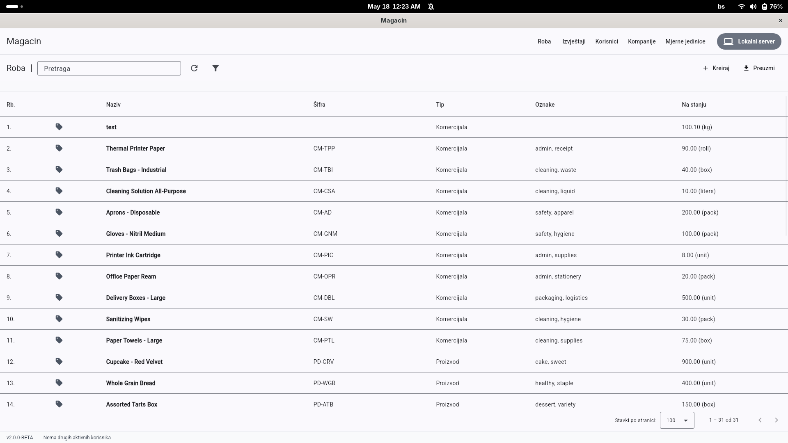
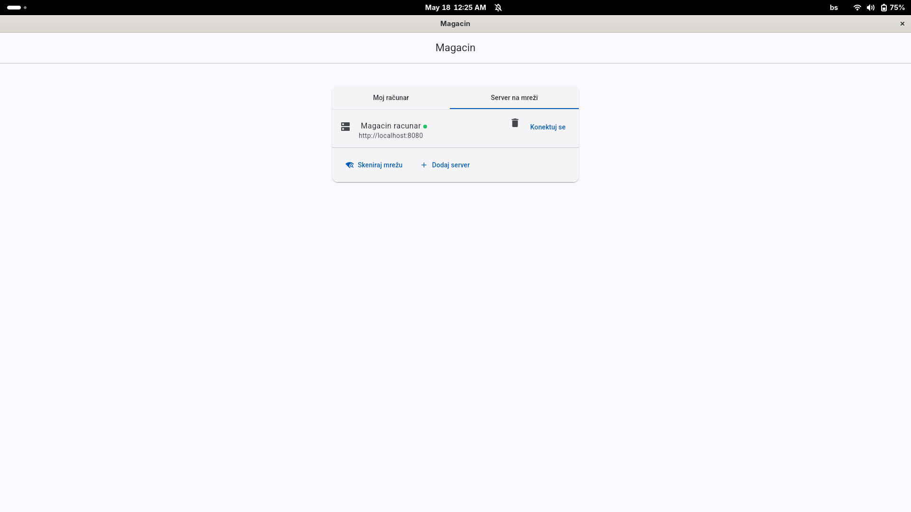
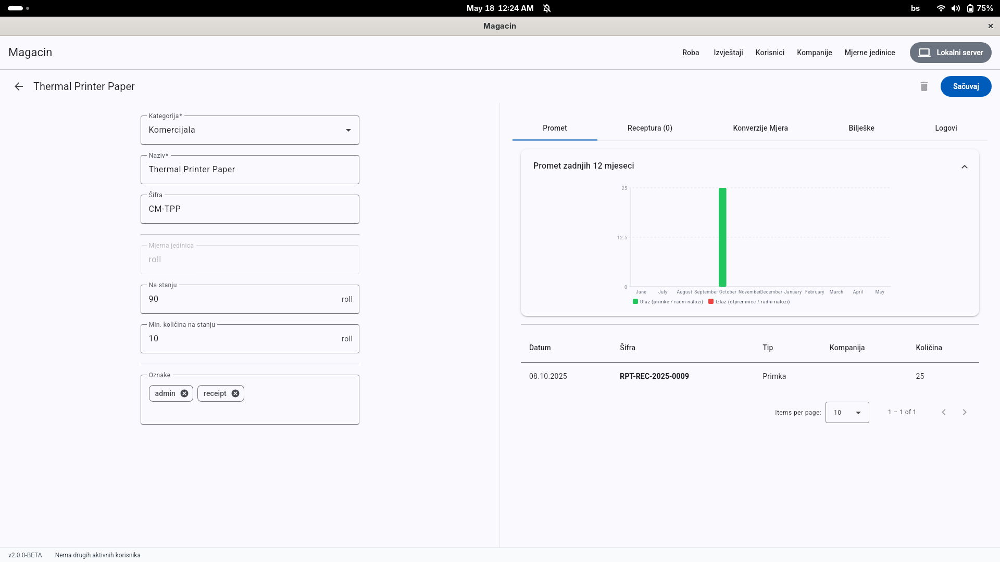
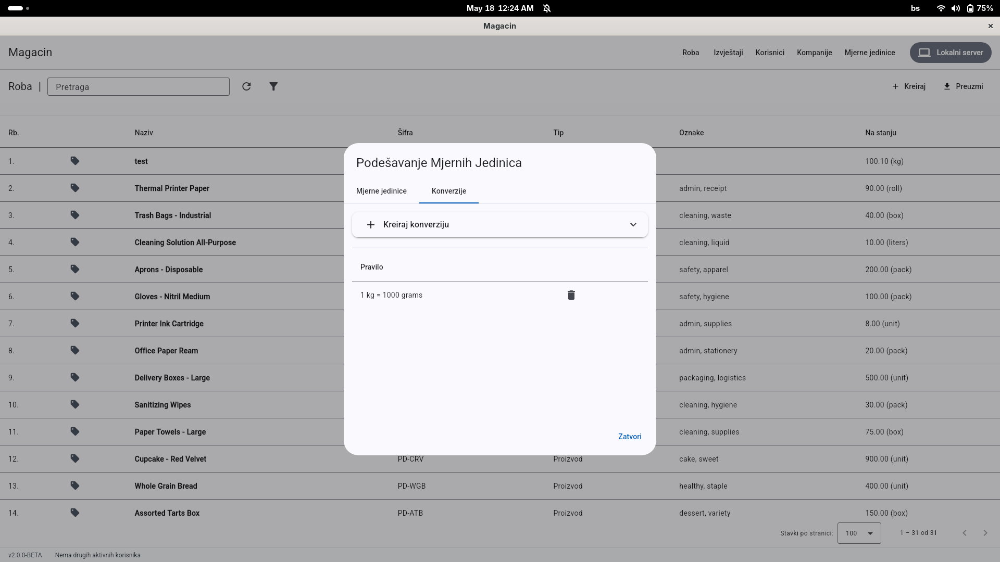
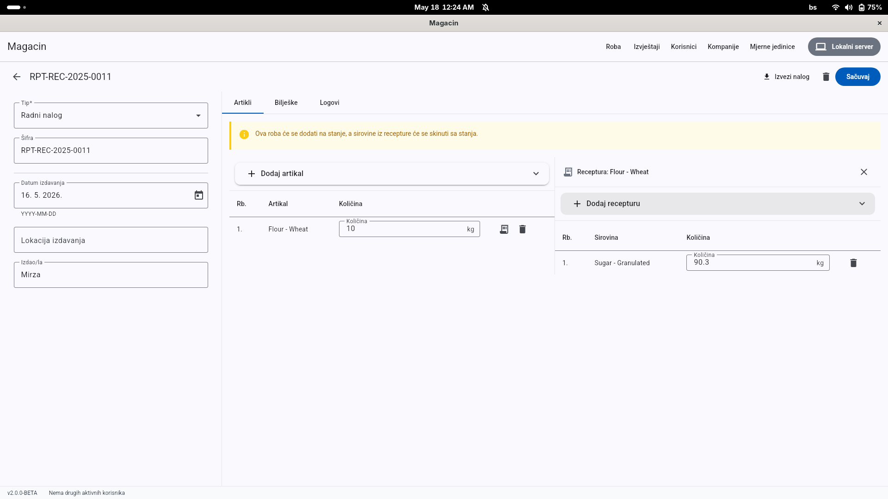

# Magacin

[](https://github.com/hrvanovicm/magacin/actions/workflows/wails-build.yml)

A lightweight, efficient warehouse management application built with Go and Wails. Designed to operate seamlessly across different network environment.

---

## 🚀 Features

* **Core Warehouse Management:** Full tracking of goods, automatic stock updates, and custom unit of measure creation/conversion.
* **Documents & Workflows:** Create and manage incoming shipments (*ulazi*), outgoing shipments (*izlazi*), and work orders (*radni nalozi*).
* **Data Export:** Download and export warehouse metrics and tables directly to `.xlsx` format.
* **User Management:** Multi-user support featuring detailed user activity logging.
* **Flexible Deployment (WIP):** Full offline capability, with support for local networks (LAN) or online synchronization.
* **Localization:** Currently localized exclusively in **Bosnian**.

---

## 📸 Screenshots

<p align="center">
  
  
</p>
<p align="center">
  
  
</p>
<p align="center">
  
</p>

---

## 🛠️ Built With

* [Go](https://go.dev/) – Core backend engine
* [Wails](https://wails.io/) – Desktop application framework

---

## 💻 Supported OS

* **Linux:** Fully supported & tested
* **Windows:** Fully supported & tested
* **macOS:** Untested

---

## 🎯 Next goals

1. **Spring clean** – Code refactoring, cleanups, and architectural improvements.
2. **End to End API encryption** – Complete secure communication between frontend client and backend service.
3. **Backup** – Add automatic backup of the database.
4. **Bug fixes** – Standard maintenance, resolving outstanding compilation and runtime issues.
5. **Better xlsx templates** – Enhancing spreadsheet exports with cleaner designs and templates.

---

## ⚙️ Contribute

### Clone
1. Clone the repository:
   ```bash
   git clone https://github.com/hrvanovicm/magacin.git

### Build for Linux and Windows
1. Clone the repository:
   ```bash
   chmod +x ./build.sh
   ./build.sh
   ```